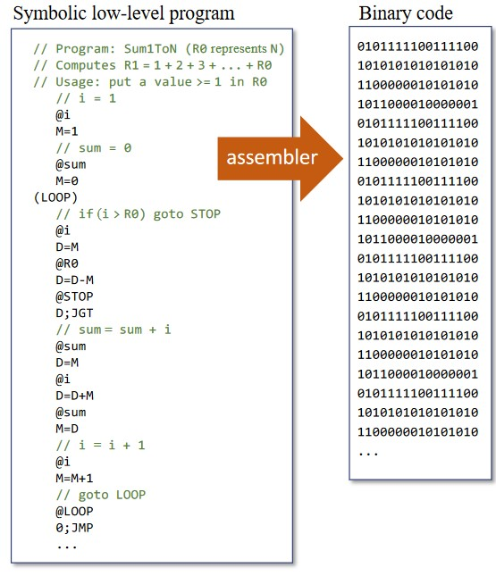

# Assembler 
 
#### This project is doing the complete functionality of an assembler converting assembly code to machine code  but with small instruction set for a small processor that i have implemented in simulation tool.



## Usage/Examples

The program can have any number of input but they must me in same directory in folder called inputs
and the outputs folder will contain the resultant machinde code files .

```bash
assembler.exe file1.asm file2.asm file3.asm ...etc
```
the output will be file1.hack , file2.hack , file3.hack ...etc

